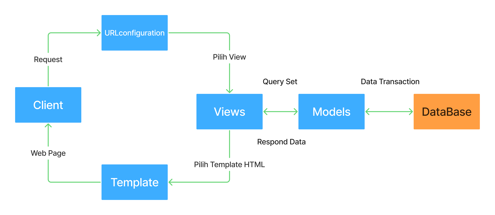
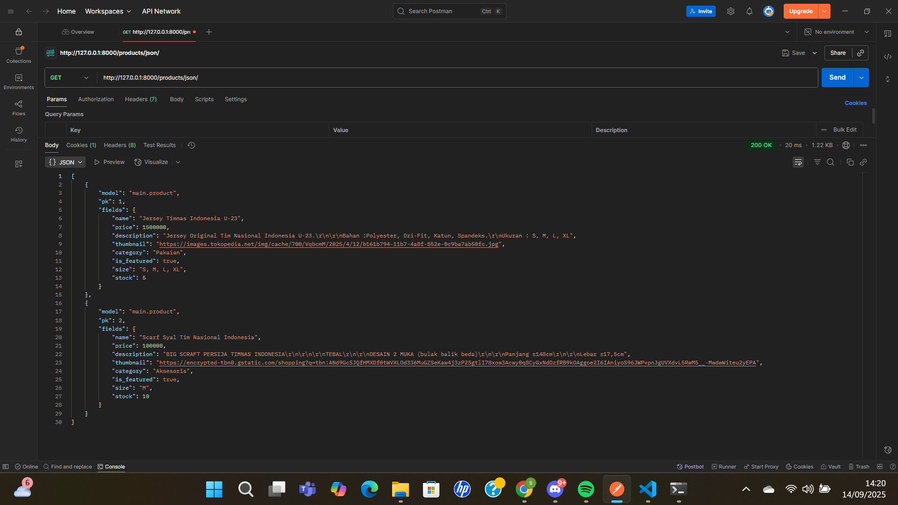
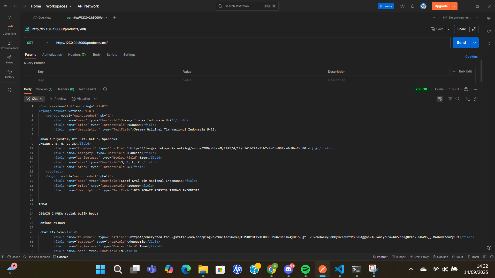
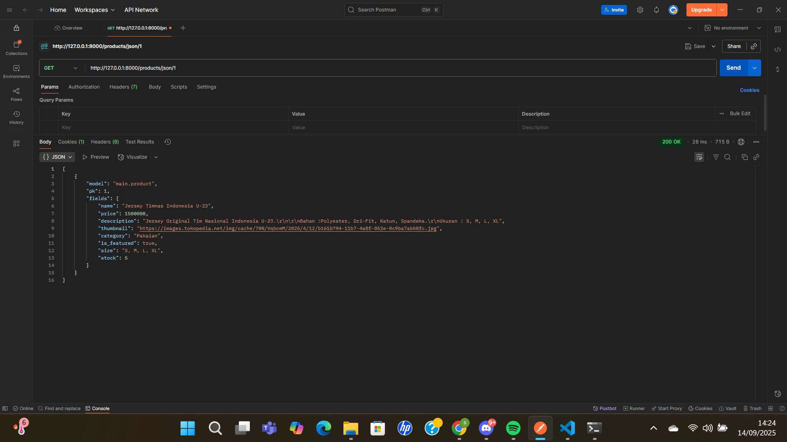
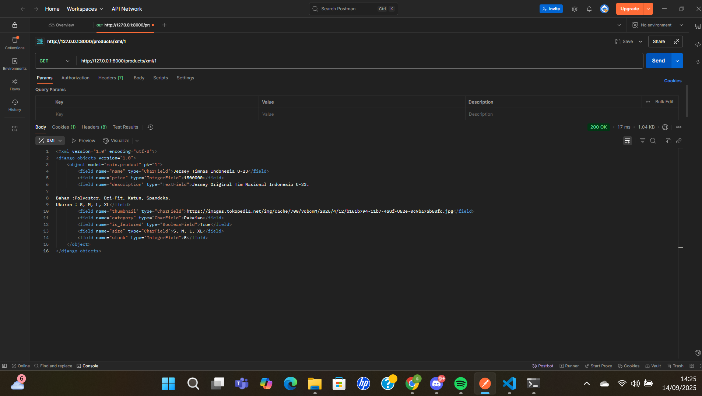

Nama  : Zibeon Jonriano Wisnumoerti
Kelas : PBP D
NPM   : 2406355634

### Tautan Web        : https://zibeon-jonriano-garudastore.pbp.cs.ui.ac.id/
### Tautan Repositori : https://github.com/zibeonjonriano/garuda-store

---

# Tugas 2: Implementasi Model-View-Template (MVT) pada Django

## "1. Jelaskan bagaimana cara kamu mengimplementasikan checklist di atas secara step-by-step (bukan hanya sekadar mengikuti tutorial)."

### "A. Membuat sebuah proyek Django baru."

        1. Saya membuka akun GitHub dan membuat repositori proyek untuk Tugas Individu 2 yang bertemakan footballshop ini dengan nama "garuda-store". Saya buat repositori tersebut bersifat public.

        2. Lalu saya memilih lokasi penyimpanan di penyimpanan lokal komputer saya untuk melakukan clonning repo dengan menggunakan "cd {lokasi}" dan "git clone https://github.com/zibeonjonriano/garuda-store.git".

        3. Membuat virtual environment dengan "python -m venv env" dan mengaktifkannya dengan "env\Scripts\activate".

        4. Lalu dalam direktori yang sama, saya membuat file "requirements.txt" yang berisikan : 
            django
            gunicorn
            whitenoise
            psycopg2-binary
            requests
            urllib3
            python-dotenv

        5. Lalu saya menginstall semua hal yang diperlukan dengan melakukan command "pip install -r requirements.txt"

        6. Setelah berhasil terinstall, saya membuat proyek django baru bernama "garuda_store" dengan command "django-admin startproject garuda_store ."

        7. Setelah berhasil membuat projek django baru, saya melakukan konfigurasi environtments variables dan proyek, dengan membuat file ".env" di dalam direktori root proyek (di mana file manage.py berada). Lalu menambahkan konfigurasi ini "PRODUCTION=False".

        8. Saya juga membuat file .env.prod di direktori yang sama untuk konfigurasi production : 
            DB_NAME=<nama database>
            DB_HOST=<host database>
            DB_PORT=<port database>
            DB_USER=<username database>
            DB_PASSWORD=<password database>
            SCHEMA=tugas_individu <- sesuai ketentuan>
            PRODUCTION=True
        Dimana setiap datanya mengikuti kredensial database yang sudah diberikan di email UI.

        9. Saya memodifikasi file "settings.py" dengan menambahkan kode berikut di bagian atas file (setelah import path) : 
            import os
            from dotenv import load_dotenv
            # Load environment variables from .env file
            load_dotenv()
        Hal ini dilakukan untuk menggunakan environment variables.

        10. Setelah itu saya menambahkan "ALLOWED_HOSTS = ["localhost", "127.0.0.1"]" di "settings.py" untuk keperluan development, sebab bagian tadi berfungsi sebagai daftar host yang diizinkan untuk mengakses aplikasi web. (dengan menambahkan bagian tsb, artinya saya bisa mengakses web secara lokal saja).

        11. Menambahkan konfigurasi "PRODUCTION = os.getenv('PRODUCTION', 'False').lower() == 'true'" tepat diatas kode DEBUG dalam "settings.py".

        12. Mengubah konfigurasi database di "settings.py". Ganti kode bagian DATABASES dengan kode :
            # Database configuration
            if PRODUCTION:
                # Production: gunakan PostgreSQL dengan kredensial dari environment variables
                DATABASES = {
                    'default': {
                        'ENGINE': 'django.db.backends.postgresql',
                        'NAME': os.getenv('DB_NAME'),
                        'USER': os.getenv('DB_USER'),
                        'PASSWORD': os.getenv('DB_PASSWORD'),
                        'HOST': os.getenv('DB_HOST'),
                        'PORT': os.getenv('DB_PORT'),
                        'OPTIONS': {
                            'options': f"-c search_path={os.getenv('SCHEMA', 'public')}"
                        }
                    }
                }
            else:
                # Development: gunakan SQLite
                DATABASES = {
                    'default': {
                        'ENGINE': 'django.db.backends.sqlite3',
                        'NAME': BASE_DIR / 'db.sqlite3',
                    }
                }

        13. Buka CMD dan pastikan lokasi terkini adalah direktori yang setara dengan keberadaan berkas "manage.py" lalu jalan kan migrasi dengan perintah "python manage.py migrate". dan jalankan server django dengan perintah "python manage.py runserver".

        14. Buka http://localhost:8000 pada browser dan dapat dilihat bahwa aplikasi django telah berhasil dibuat.

        15. Jika ingin menonaktifkan virtual environment bisa langsung CTRL + C pada CMD atau jalankan perintah "deactivate" pada CMD.

        16. Sebelum setiap progres di push ke repo GitHub, saya membuat file .gitignore terlebih dahulu supaya berkas berkas lain tidak ikut ter-push ke repo GitHub saya.

        17. Buat branch utama dengan nama master "git branch -M master".

        18. Lalu lakukan add, commit dan push dari direktori lokal ke repo GitHub.
            git add .
            git commit -m "Create new project for Tugas 2"
            git push origin master

### "B. Membuat aplikasi dengan nama main pada proyek tersebut."

        1. Pertama saya masuk ke direktori proyek, dengan menuliskan perintah "cd garuda-store" di CMD.

        2. Sebelum saya membuat aplikasi main pada proyek saya, saya mengaktifkan virtual environment terlebih dahulu, dengan cara "env\Scripts\activate".

        3. Buat aplikasi baru dengan nama "main" dengan menggunakan perintah "python manage.py startapp main".

        4. Mendaftarkan apliaksi main ke dalam proyek, dengan membuka berkas settings.py dalam direktori "garuda-store", tambahkan "main" dalam daftar aplikasi yang terdapat pada variabel INSTALLED_APP. Maka aplikasi main berhasil dibuat.

### "C. Melakukan routing pada proyek agar dapat menjalankan aplikasi main."

        1. Saya mengonfigurasi routing URL proyek dengan membuat berkas "urls.py" pada level proyek, hal ini dilakukan supaya proyek dapat melakukan pemetaan ke rute URL pada aplikasi main.

        2. Buka "urls.py" dalam direktori "garuda_store", lalu import fungsi include dari django.urls seperti "from django.urls import path, include".

        3. Tambahkan rute URL berikut :
            urlpatterns = [
                ...
                path('', include('main.urls')),
                ...
            ]
        supaya dapat mengarahkan ke tampilan main dalam urlpatterns.

### "D. Membuat model pada aplikasi main dengan nama Product dan memiliki atribut wajib."

        1. Buka berkas "models.py" pada direktori aplikasi main.

        2. Lalu isi berkas "models.py" dengan class Product dan atribut-atribut wajib sesuai ketentuan. Seperti berikut :
            from django.db import models
            # Create your models here.
            class Product(models.Model):
                #atribut wajib 
                name = models.CharField(max_length=200)
                price = models.IntegerField()
                description = models.TextField()
                thumbnail = models.URLField()
                category = models.CharField(max_length=100)
                is_featured = models.BooleanField(default=False)

                #atribut opsional
                size = models.CharField(max_length=20, blank=True) # S, M, L, XL
                stock = models.IntegerField(default=0)

            def __str__(self):
                return f"{self.name} ({self.team})"
            # itu fungsinya buat nge-representasikan object Product jadi string yang lebih gampang dibaca.
        
        3. Setelah membuat model, setiap perubahan pada model basis data yang dibuat harus di migrasi untuk menghindari terjadinya error akibat tidak singkronnya kode dengan database.

        4. Caranya dengan menjalankan perintah "python manage.py makemigrations" yang menciptakan berkas migrasi yang berisi perubahan model yang belum diaplikasikan ke dalam basis data.

        5. Lalu jalankan perintah "python manage.py migrate" untuk melakukan pengaplikasian perubahan model yang tercantum dalam berkas migrasi ke basis data. 

### "E. Membuat sebuah fungsi pada views.py untuk dikembalikan ke dalam sebuah template HTML yang menampilkan nama aplikasi serta nama dan kelas saya."

        1. Buka berkas "views.py" yang ada pada aplikasi "main".

        2. Tambahkan "from django.shortcuts import render" jika belum ada.

        3. Tambahkan fungsi "show_main" yang menerima parameter request yang dimana fungsi ini akan mengatur permintaan HTTP dan mengembalikan yang sesuai. Seperti ini :
            # main/views.py
            from django.shortcuts import render

            def show_main(request):
                context = {
                    "app_name": "Garuda Store",
                    "student_name": "ZIbeon Jonriano Wisnumoerti",
                    "class_name": "PBP D"
                }
                return render(request, "main.html", context)
            
            variabel context disini adalah dictionary yang berisi data yang akan ditampilkan yaitu nama aplikasi, nama saya dan asal kelas saya (sesuai ketentuan).

            return render(request, "main.html", context) disini berguna untuk merender tampilan main.html. Request disini artinya objek permintaan HTTP yang dikirim oleh user. Lalu main.html adalah nama berkas templatenya.

        4. Buat folder atau direktori dengan nama "templates" dalam direktori main. Lalu buat & buka berkas "main.html" dan isi menggunakan kode yang menampilkan nama aplikasi, nama mahasiswa, dan asal kelasnya seperti berikut ini :
            <!-- main/templates/main/home.html -->
            <h1>{{ app_name }}</h1>
            
Nama Mahasiswa   : {{ student_name }}

            
Kelas            : {{ class_name }}

### "F. Membuat sebuah routing pada urls.py aplikasi main untuk memetakan fungsi yang telah dibuat pada views.py."

        1. Pertama saya mengonfigurasi routing URL aplikasi main dengan cara membuat berkas "urls.py" di dalam direktori main.

        2. Isi urls.py dengan kode : 
            from django.urls import path
            from main.views import show_main

            app_name = 'main'

            urlpatterns = [
                path('', show_main, name='show_main'),
            ]
        routing pada aplikasi main sudah selesai dilakukan.

        3. Jalankan proyek django dengan "python manage.py runserver" di CMD.

        4. Bukalah http://localhost:8000/ di web browser untuk melihat halaman yang telah dibuat.

### "G. Melakukan deployment ke PWS terhadap aplikasi yang sudah dibuat."

        1. Buka halaman PWS pada https://pbp.cs.ui.ac.id.

        2. Login dengan akun SSO UI.

        3. Buat proyek baru dengan menekan tombol "Create New Project" dan buat project dengan nama "garudastore". Lalu tekan "Create New Project" di bawahnya.

        4. Setelah muncul dua informasi baru, yaitu mengenai Project Credentials dan Project Command. Simpan/salin credentials yang tampil ke tempat yang aman, karena seterusnya credentials ini tidak akan bisa kamu lihat lagi. Jangan jalankan dulu instruksi Project Command.

        5. Kemudian pada sidebar pilih proyek yang teolah dibuat, lalu buka tab "Environs". Klik "Raw Editor" dan copy paste isi file ".env.prod" yang ada pada direktori proyek di lokal komputer.
        6. Klik "Update All Variables".

        7. Pada "settings.py" di proyek Django yang sudah dibuat tadi, tambahkan URL deployment PWS "https://zibeon-jonriano-garudastore.pbp.cs.ui.ac.id/" pada ALLOWED_HOSTS menjadi seperti ini :
            ALLOWED_HOSTS = ["localhost", "127.0.0.1","zibeon-jonriano-garudastore.pbp.cs.ui.ac.id"]

        8. Setelah itu Lakukan git add, commit, dan push perubahan ini ke repositori GitHub.
            git add .
            git commit -m "Create model Product and deployment to PWS"
            git push origin master

        9. Jalankan perintah yang terdapat pada informasi Project Command pada halaman PWS. Ketika melakukan push ke PWS, akan ada window yang meminta username dan password. Masukkan username dan password yang sebelumnya disalin dari tahap ke 4.

        10. Pada side bar situs PWS, klik proyek yang telah dibuat. Disana juga dapat melihat status deployment proyek saat ini. Apabila statusnya "Building", artinya proyek masih dalam proses deployment. Apabila statusnya "Running", maka proyek sudah bisa diakses pada URL deployment. Selain itu, kita juga bisa menekan tombol "View Project" yang terdapat pada halaman proyek untuk melihat tampilan web yang sudah dibuat.

        11. Terakhir lakukan "git push pws master".

## "2. Buatlah bagan yang berisi request client ke web aplikasi berbasis Django beserta responnya dan jelaskan pada bagan tersebut kaitan antara urls.py, views.py, models.py, dan berkas html."

    Penjelasan Alur Sepemahaman Saya:
        1. Client (Browser) -> User mengirim request ke server (misalnya membuka https://zibeon-jonriano-garudastore.pbp.cs.ui.ac.id/).

        2. URL Configuration (urls.py) -> "urls.py" berfungsi sebagai router, ia akan mencocokan url yang diminta client dengan pola yang ada di "urlpatterns".

        3. Views (views.py) -> "views.py" ini berisi logika aplikasi, setelah menerima request dari "urls.py", view bisa langsung merender HTML (jika tidak butuh data dari database) ataupun meminta data dari "models.py".

        4. Models (models.py) -> "models.py" adalah representasi tabel database, jika view butuh data (misalnya daftar produk), view akan melakukan query ke model. Model lalu berkomunikasi dengan database untuk ambbil/simpan data.

        5. Database -> adalah tempat penyimpanan data sebenarnya, model akan melakukan data transaction (CRUD: Create, Read, Update, Delete). Hasil query dikembalikan ke "views.py".

        6. Template (HTML file) -> Setelah data dari model diterima, view akan memilih template HTML untuk merender data.

        7. Response -> Template yang sudah diisi data dikembalikan sebagai web page ke browser, dan client akhirnya melihat hasil tampilan di halaman web.

## "3. Jelaskan peran settings.py dalam proyek Django!".

    Dalam proyek Django, settings.py berfungsi sebagai pusat konfigurasi aplikasi. File ini mengatur berbagai aspek penting, seperti daftar aplikasi yang digunakan (INSTALLED_APPS), middleware, konfigurasi database, lokasi file statis dan media, kunci keamanan (SECRET_KEY), mode debug, host yang diizinkan (ALLOWED_HOSTS), serta pengaturan bahasa dan zona waktu. Singkatnya, settings.py menentukan bagaimana proyek Django dijalankan, berinteraksi dengan database, menangani keamanan, dan menampilkan konten ke pengguna.

## "4.Bagaimana cara kerja migrasi database di Django?".

    Menyinkronkan perubahan yang dibuat pada "models.py" dengan struktur tabel di database disebut migrasi database. Caranya: 

        1. Ketika kita mengubah atau menambah model, Django mencatat perubahan tersebut dalam file migrasi melalui perintah "python manage.py makemigrations". File migrasi ini berisi instruksi perubahan skema database. 

        2. Selanjutnya, perintah "python manage.py migrate" menjalankan instruksi tersebut ke database sehingga tabel dan kolom sesuai dengan definisi model terbaru. Dengan begitu, database selalu konsisten dengan kode model yang kita buat.

## "5. Menurut Anda, dari semua framework yang ada, mengapa framework Django dijadikan permulaan pembelajaran pengembangan perangkat lunak?".

    Django dijadikan framework pengantar dalam pembelajaran pengembangan perangkat lunak karena mudah dipelajari namun lengkap. Framework ini menyediakan banyak fitur bawaan seperti ORM, autentikasi, admin panel, dan templating, sehingga mahasiswa dapat fokus memahami konsep fundamental web development tanpa harus membuat semuanya dari nol. Dengan arsitektur Model-View-Template (MVT), Django membantu pemula mempelajari pemisahan tugas antara data, logika aplikasi, dan tampilan dengan jelas. Selain itu, Django mendorong praktik pengembangan perangkat lunak yang baik, seperti prinsip DRY (Don’t Repeat Yourself), serta memiliki dokumentasi lengkap dan komunitas besar. Framework ini juga relevan di dunia industri, sehingga pembelajaran Django memberi dasar yang kuat sekaligus pengalaman yang berguna untuk proyek nyata.

## "6. Apakah ada feedback untuk asisten dosen tutorial 1 yang telah kamu kerjakan sebelumnya?".

    Untuk tutorial 1 yang telah saya kerjakan sebelumnya, menurut saya semua instruksi dan penjelasan terkait tutorial sudah disampaikan dengan baik dan detail, dan layanan bantuan jika mahasiswa mengalami masalah selama tutorial berlangsung juga sangat membantu mahasiswa dalam mengerjakan tutorial. Mungkin saran saya upaya ini bisa terus dipertahankan atau ditingkatkan lebih lagi untuk menunjang pengalaman belajar mahasiswa yang efektif dan menyenangkan, Terimakasih.

---

# Tugas 3: Implementasi Form dan Data Delivery pada Django

## 1.Jelaskan mengapa kita memerlukan data delivery dalam pengimplementasian sebuah platform?

    Data delivery misalnya XML/JSON memungkinkan pengiriman dan pertukaran data antar sistem yang berbeda dengan cara yang terstruktur dan terstandarisasi. Data delevery ini memungkinkan backend menyediakan data yang bisa dikonsumsi oleh klien lain (web, mobile, service lain). Ini penting untuk integrasi antar-sistem dan pemisahan frontend-backend.

## 2.Menurutmu, mana yang lebih baik antara XML dan JSON? Mengapa JSON lebih populer dibandingkan XML?  

    Menurut saya, JSON umumnya lebih disukai untuk aplikasi web karena formatnya yang ringan, deskriptif, mudah dibaca, dan kompatibel dengan kerangka kerja JavaScript, serta mendukung penguraian yang cepat. Sebaliknya, XML lebih cocok untuk aplikasi yang membutuhkan representasi data yang kompleks dan validasi data yang mendalam. XML juga menawarkan deskripsi yang lebih rinci dan berbagai fitur tambahan. Jadi pemilihan antara JSON dan XML sangat bergantung pada kebutuhan spesifik proyek. 

## 3. Jelaskan fungsi dari method is_valid() pada form Django dan mengapa kita membutuhkan method tersebut?
    
    Method `is_valid()` pada form Django berfungsi untuk memeriksa apakah data yang diinput pengguna sesuai dengan aturan validasi yang telah ditentukan pada form. Jika valid, method ini akan mengembalikan nilai `True` sehingga data dapat diproses atau disimpan ke database, sedangkan jika tidak valid, method ini mengembalikan `False` dan menyimpan pesan error yang bisa ditampilkan kepada pengguna. Dengan demikian, `is_valid()` penting untuk menjaga integritas data, mencegah error, serta memberikan umpan balik ketika terjadi kesalahan input.

## 4. Mengapa kita membutuhkan csrf_token saat membuat form di Django? Apa yang dapat terjadi jika kita tidak menambahkan csrf_token pada form Django? Bagaimana hal tersebut dapat dimanfaatkan oleh penyerang?

    Kita membutuhkan csrf_token saat membuat form di Django karena token ini berfungsi sebagai mekanisme keamanan untuk mencegah Cross-Site Request Forgery (CSRF), yaitu serangan di mana penyerang mencoba mengirim request berbahaya ke server atas nama pengguna tanpa sepengetahuan mereka. Jika csrf_token tidak ditambahkan, form menjadi rentan dieksploitasi, penyerang dapat membuat halaman berisi form tersembunyi yang secara otomatis mengirim request ke aplikasi kita ketika pengguna yang sedang login membukanya. Akibatnya, data bisa dimanipulasi atau transaksi berbahaya dilakukan tanpa izin. Dengan csrf_token, server akan memverifikasi bahwa setiap request POST berasal dari form sah yang dibuat aplikasi, sehingga serangan semacam ini bisa dicegah.

## 5. Jelaskan bagaimana cara kamu mengimplementasikan checklist di atas secara step-by-step (bukan hanya sekadar mengikuti tutorial).

    1. Pertama-tama saya memastikan terdapat model `Product` yang sudah dibuat sebelumnya di models.py.

    2. Saya membuat folder templates dan mengisinya dengan `base.html` di directory ROOT Project, yang nantinya bisa di extends oleh file html lainnya.

    3. Lalu saya menambahkan kode:
        ...
        TEMPLATES = [
            {
                'BACKEND': 'django.template.backends.django.DjangoTemplates',
                'DIRS': [BASE_DIR / 'templates'], # Tambahkan konten baris ini
                'APP_DIRS': True,
                ...
            }
        ]
        ...
        Agar file `base.html` terdeteksi sebagai file template.

    4. Selanjutnya saya membuat beberapa fungsi di `main\views.py` yaitu :
        def products_json(request):
            products = Product.objects.all()
            data = serializers.serialize("json", products)
            return HttpResponse(data, content_type="application/json")

        def products_xml(request):
            products = Product.objects.all()
            data = serializers.serialize("xml", products)
            return HttpResponse(data, content_type="application/xml")

        def product_json_by_id(request, id):
            product = get_object_or_404(Product, pk=id)
            data = serializers.serialize("json", [product])
            return HttpResponse(data, content_type="application/json")

        def product_xml_by_id(request, id):
            product = get_object_or_404(Product, pk=id)
            data = serializers.serialize("xml", [product])
            return HttpResponse(data, content_type="application/xml")
        
    5. Membuat routing URL untuk masing-masing fungsi yang baru ditambahkan di `views.py` tadi, dengan :
        path("products/json/", products_json, name="products_json"),
        path("products/xml/", products_xml, name="products_xml"),
        path("products/json/<int:id>/", product_json_by_id, name="product_json_by_id"),
        path("products/xml/<int:id>/", product_xml_by_id, name="product_xml_by_id"),

    6. Lalu saya mengedit `main.html` yang berada di folder main agar memiliki tombol "Add Product" yang langsung mendirect ke halaman form dan menampilkan deretan produk yang sudah di add. Setelah produk sudah di Add, user bisa melihat detail produk dengan menekan tombol "Detail pada daftar produk yang tampil di halaman.

    7. Lalu saya membuat `add_product.html` yang berisi form penambahan produk dan `product_detail.html` yang berisi deskripsi detail dari produk yang telah ditambahkan.

    8. Tidak lupa bahwa saya membuat fungsi tambahan lagi di `views.py` dalam folder main agar html yang dibuat sebelumnya dapat berfungsi. Kode nya sebagai berikut :
        def add_product(request):
            form = ProductForm(request.POST or None)

            if form.is_valid() and request.method == "POST":
                form.save()
                return redirect('main:show_main')

            context = {'form': form}
            return render(request, "add_product.html", context)

        def product_detail(request, id):
            product = get_object_or_404(Product, pk=id)

            context = {
                'product': product
            }

            return render(request, "product_detail.html", context)
    
    9. Selanjutnya saya membuat routing URL lagi untuk funsgi "add_product" dan "product_detail".
        path("products/<int:id>/", product_detail, name="product_detail"),
        path("products/add/", add_product, name="add_product"),

    10. Menambahkan daftar domain web ke `settings.py` yang ada di folder ROOT project supaya user dapat melakukan "Add Product" (Pengisian Form) melalui domain tersebut karena berasal dari sumber yang terpercaya.
            CSRF_TRUSTED_ORIGINS = [
                "https://zibeon-jonriano-garudastore.pbp.cs.ui.ac.id"
            ]

## 6. Apakah ada feedback untuk asdos di tutorial 2 yang sudah kalian kerjakan?
    Untuk saat ini belum ada.

## 7.  Mengakses keempat URL di poin 2 menggunakan Postman, membuat screenshot dari hasil akses URL pada Postman, dan menambahkannya ke dalam README.md.

    1. JSON
    `http://127.0.0.1:8000/products/json/` 
    

    2. XMl
    `http://127.0.0.1:8000/products/xml/`
    

    3. JSON by id
    `http://127.0.0.1:8000/products/json/1`
    

    4. XML by id
    `http://127.0.0.1:8000/products/xml/1`
    
        
